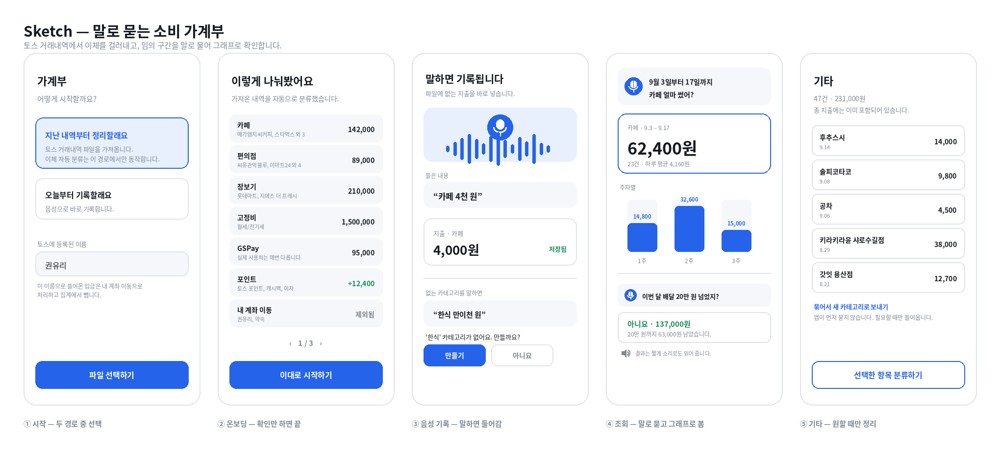

# Pitch

## Problem

토스 거래내역을 보면 소비 규모를 파악하기 어렵습니다. 저는 이체가 잦은 편인데, 문제는 이체가 한 덩어리로 묶여 있다는 점입니다. 내 다른 계좌로 옮긴 돈, 친구에게 보낸 정산금, 앱으로 결제한 돈이 모두 입금과 출금이라는 같은 유형으로 기록되어, 원하는 종류만 골라 합계를 볼 수 없습니다.

파일을 받아도 마찬가지입니다. 파일에는 적요, 거래 유형, 거래 기관, 계좌번호가 있지만 이것만으로 성격이 갈리지 않습니다. 예를 들어 `토스 포인트`와 친구가 보낸 돈은 둘 다 `입금 / 하나은행`으로 똑같이 기록됩니다. 어느 쪽인지는 사람만 판단할 수 있고, 진짜 문제는 그 판단을 볼 때마다 반복해야 한다는 점입니다.

조회도 불편합니다. 토스는 지출을 월 단위로 보여주고, 특정 날의 내역은 볼 수 있지만 특정 구간(예: 9월 3일부터 17일까지)의 총합은 계산해 주지 않습니다. 구간의 소비 규모를 알려면 달력을 넘겨 가며 직접 더해야 합니다.

이체 빈도는 사람마다 다르므로, 이 문제의 크기가 모두에게 같지는 않습니다. 다만 이체가 잦은 사용자에게는 앱에 표시된 지출을 그대로 믿기 어려운 수준이 됩니다.

## Who else?

지출을 자주 확인하며 돈을 관리하는 사람입니다. 첫 대상은 아래와 같은 사용자입니다.

- 이체가 잦아 앱에 표시되는 지출이 실제 소비와 다르게 보이는 사람
- 여행이나 월 중간 정산처럼 특정 구간의 소비 총합을 알고 싶은 사람
- 본업 외에 부업이나 알바 수입이 있어 수입도 나누어 보고 싶은 사람
- 앱을 열어 화면을 찾아 들어가는 것이 번거로워, 궁금할 때 말로 묻고 답과 그래프로 바로 확인하며 돈을 관리하고 싶은 사람

이 가정은 베타 배포 단계에서 실제 사용자의 반응으로 검증합니다.

## Existing solutions

**토스**는 내역마다 지출 합계에서 제외할 수 있고, 같은 유형을 앞으로도 제외하는 옵션이 있습니다. 다만 이체가 잦으면 손이 많이 가고, 한 번 제외한 내역을 다시 포함시킬 때는 일괄 설정이 없습니다. 또한 조회는 월 단위가 기본이라 임의 구간의 합계는 볼 수 없습니다. 기업은행 앱에서도 같은 불편을 확인했습니다.

**뱅크샐러드**는 자연어로 소비를 물어볼 수 있는 대화형 AI를 제공하고, 카테고리 분류와 엑셀 내보내기도 지원합니다. 다만 마이데이터 연동과 로그인이 전제이고, 답변이 문장으로 나오기 때문에 그 안의 금액을 사용자가 검산할 수 없습니다.

**편한가계부와 여러 AI 가계부 앱**은 음성 입력을 지원하고, 일부는 음성으로 검색까지 지원합니다. 다만 은행 파일을 가져와 이체와 소비를 나누는 기능은 없습니다.

즉 자연어 조회도, 음성 입력도 이미 존재합니다. 이 제품이 다른 점은 두 가지입니다. **파일에서 이체를 걸러낸 뒤 한 번 내린 판단을 기억해 다시 묻지 않고**, **묻는 것은 말 한마디로 끝나되 답은 숫자와 그래프로 보여 준다**는 점입니다.

## Solution

토스 거래내역 파일을 가져와 이체와 소비를 나누고, 사용자가 만든 카테고리로 분류한 뒤, 한 문장으로 임의 구간을 조회하는 앱입니다.

- **고정 유형과 사용자 카테고리**: 모든 거래는 수입, 지출, 이체 중 하나입니다. 세 유형 모두 사용자가 카테고리를 만들 수 있고, 카테고리는 하나의 유형에 속합니다. 이체 카테고리는 집계 포함 여부를 각각 정합니다. 예를 들어 내 계좌 이동은 빼고, 친구 정산은 따로 합계를 봅니다.

- **파일 가져오기**: 거래 유형과 적요로 대부분을 자동 분류합니다. 체크카드 결제는 지출, 포인트와 캐시백과 이자는 수입, 적요가 본인 이름인 입금은 내 계좌 이동입니다. 출금은 상대 계좌번호를 내 계좌 목록과 대조해 판정합니다. 처음 보는 적요는 되묻지 않고 적요를 그대로 카테고리로 만들어 둡니다.

- **적요 사전**: 적요와 카테고리를 사용자별 표로 저장해, 같은 적요가 다시 나오면 자동으로 적용합니다. 다만 `GSPay`나 `네이버페이`처럼 결제 수단만 남는 적요는 매번 실제 사용처가 다르므로, 하나의 카테고리로 묶어 두고 사용자가 원할 때만 나눕니다.

- **온보딩**: 파일을 가져오면 자동으로 나눈 카테고리와 금액을 표로 보여 주고, 사용자는 확인만 하면 시작됩니다. 카테고리가 많으면 페이지로 넘기며 보고, 언제든 나머지를 건너뛸 수 있습니다. 분류되지 않은 거래는 기타로 모으되, 펼쳐서 새 카테고리로 꺼낼 수 있습니다.

- **음성 기록**: "카페 4천 원"처럼 카테고리와 금액을 말하면 바로 기록됩니다. 화면을 열고 항목을 채우는 과정이 없습니다. 파일에 남지 않는 지출이나, 파일 없이 오늘부터 기록하는 경우에 사용합니다. 기본 카테고리 몇 개로 시작하고, 없는 카테고리를 말하면 새로 만들지 물어봅니다.

- **음성 조회**: "이번 달 카페에 얼마 썼어?", "9월 3일부터 17일까지 식당 지출은?"처럼 물으면 임의 구간의 합계를 계산해 숫자와 그래프로 보여 줍니다. 화면을 찾아 들어가 기간을 지정하는 과정을 말 한마디로 대신합니다. "이번 달 배달 20만 원 넘었지?"처럼 확인을 요청하면 넘었는지 아닌지와 남은 금액을 함께 보여 줍니다. 결과는 짧게 소리로도 읽어 주지만, 기본 출력은 화면입니다.

- **숫자의 출처**: 금액은 거래 데이터의 집계로 계산합니다. LLM은 조회 조건을 고르고 결과를 해석하는 데에만 사용하며, 거래 내역과 금액은 보내지 않습니다.

## Sketch

## No-gos

- **은행·토스 직접 연동**: 금융 API 연동은 인증과 심사 부담이 커서, 사용자가 직접 내려받은 파일을 가져오는 방식으로 대체합니다.
- **토스 외 다른 은행의 파일 형식**: 은행마다 열 구성이 달라 파서를 따로 만들어야 하므로, 첫 버전은 토스 파일만 지원합니다.
- **여러 계좌 파일 합산**: 계좌마다 파일이 나뉘어 있어 합치려면 중복 판정이 필요하므로, 첫 버전은 토스 계좌 하나만 지원합니다.
- **파일 가져오기와 음성 기록의 혼용**: 같은 거래가 양쪽에서 들어오면 이중 집계가 되고, 이를 맞추는 로직이 무겁기 때문에 둘 중 하나를 선택해 사용합니다.
- **가져오기 중 사용자에게 분류를 되묻는 절차**: 확인 질문이 반복되면 사용자가 중간에 그만두므로, 온보딩 이후 앱은 먼저 묻지 않고 애매한 거래도 일단 분류해 둡니다.
- **온보딩에서 카테고리를 처음부터 만들게 하는 흐름**: 빈 화면에서 이름을 지어내는 일이 가장 큰 진입 장벽이므로, 자동 제안을 확인하는 방식만 제공합니다.
- **브랜드 단위 적요 묶음**: 지점마다 적요가 달라 부분 일치 규칙이 필요하지만 예외가 많으므로, 첫 버전은 적요 완전 일치로만 학습합니다.
- **하위 카테고리 다단계 구조**: 계층이 생기면 집계와 조회가 함께 복잡해지므로, 카테고리는 유형 아래에 평평하게 둡니다.
- **계좌번호 저장**: 개인정보를 남기지 않기 위해, 가져올 때 내 계좌 여부만 판정하고 번호 자체는 버립니다.
- **예산 설정과 초과 알림**: 이 제품의 목적은 쓴 돈을 정확히 아는 것이고, 예산 관리는 그다음 단계의 문제라 범위에서 뺍니다.
- **투자 조언과 투자 분석**: 가계부의 소비 집계와 성격이 다르고 책임 범위도 커서 다루지 않습니다.
- **영수증 사진 인식**: 이미지 인식은 별도 정확도 문제를 안고 있어, 파일과 음성 두 경로에 집중합니다.
- **로그인과 여러 기기 동기화**: 계정 없이 쓰는 대신 데이터는 본인 기기에만 저장하고, 기기 간 이동은 지원하지 않습니다.
- **긴 문장으로 설명하는 음성 답변**: 음성은 보조 수단이므로 금액과 결론만 짧게 읽어 주고, 해석과 비교는 화면으로 보여 줍니다.
- **가계부 질문 외의 자유 대화**: 답변 범위를 소비·수입 조회로 한정해, 엉뚱한 답이 나올 여지를 줄입니다.
